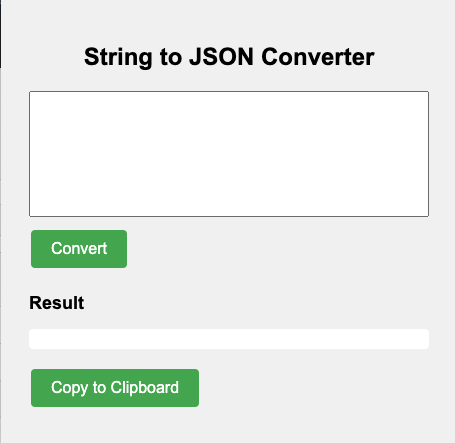

# stringToJSON
Chrome/Edge browser extension to convert any JSON like string to JSON format
Follow the following to install on your Edge/Chrome based browsers

1. Open Chrome and navigate to `chrome://extensions` or `edge://extensions`
2. Enable "Developer mode" by toggling the switch in the top right corner.
3. Click "Load unpacked" and select the "stringToJson" folder.

## Usage

1. Download the [project zip file](https://github.com/soumendrak/stringToJSON/archive/refs/tags/v0.0.1.zip)
2. Unzip the file
3. Copy any unformatted JSON string.
4. Paste it on the top box
5. Click Convert
6. Click `Copy to Clipboard` to copy the result to clipboard

## Conversions

- It replaces `True` with `true`, `False` with `false`, single quote with double quote and `None` with `null`.
